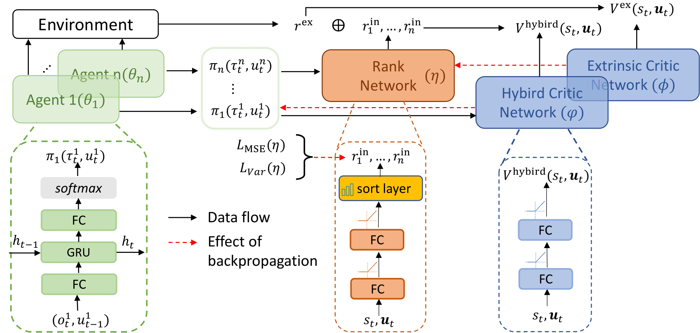

# [IJCAI 2025] Constructive Conflict-Driven Multi-Agent Reinforcement Learning for Strategic Diversity

This repo holds the official code for [Constructive Conflict-Driven Multi-Agent Reinforcement Learning for Strategic Diversity](https://www.arxiv.org/abs/2509.14276) by Yuxiang Mai, Qiyue Yin, Wancheng Ni, Pei Xu, Kaiqi Huang, and is based on [GRF](https://github.com/google-research/football), [SMAC](https://github.com/oxwhirl/smac) and [MAPPO](https://github.com/marlbenchmark/on-policy) codebases which are open-sourced.



### Setup

To get started:

1. Clone this repo and move to the CoDiCon directory:

```bash
git clone https://github.com/YuxiangMai/CoDiCon.git && cd ./CoDiCon
```

2. Create your environment and install the module dependencies:

```bash
conda create -n codicon python=3.7
conda activate codicon
pip install -r requirements.txt
```
For [SMAC](https://github.com/oxwhirl/smac) and [GRF](https://github.com/google-research/football/blob/master/README.md), please see the official repository to install the environments.


## Train
Here we use train_football_3v1.sh as an example:
```
cd onpolicy/scripts/train_football_scripts
chmod +x ./train_football_3v1.sh
./train_football_3v1.sh
```

### Cite

```bibtex
@misc{mai2025constructiveconflictdrivenmultiagentreinforcement,
      title={Constructive Conflict-Driven Multi-Agent Reinforcement Learning for Strategic Diversity}, 
      author={Yuxiang Mai and Qiyue Yin and Wancheng Ni and Pei Xu and Kaiqi Huang},
      year={2025},
      eprint={2509.14276},
      archivePrefix={arXiv},
      primaryClass={cs.MA},
      url={https://arxiv.org/abs/2509.14276}, 
}
```
